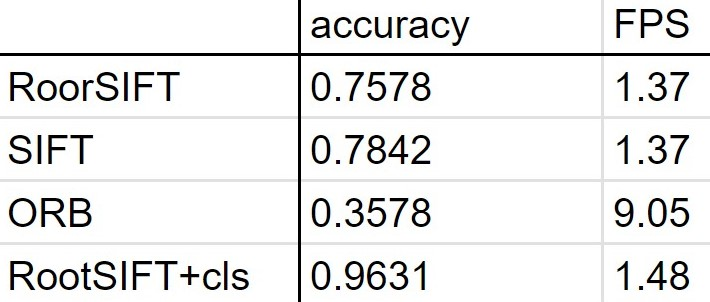
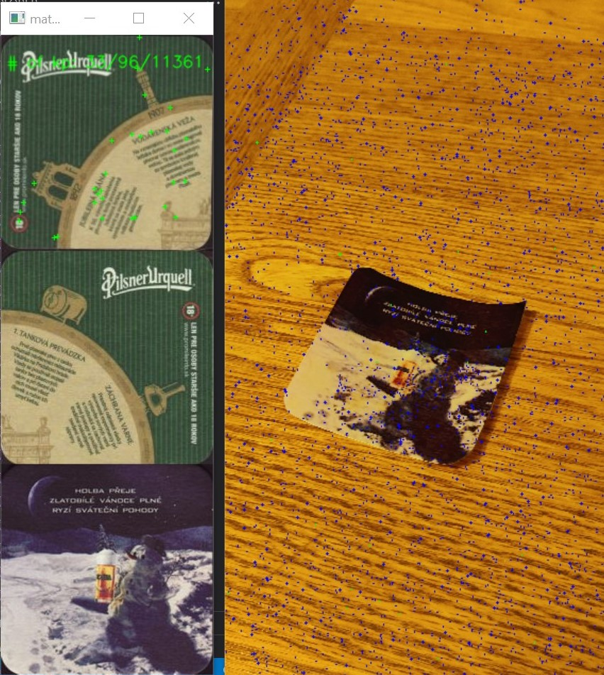
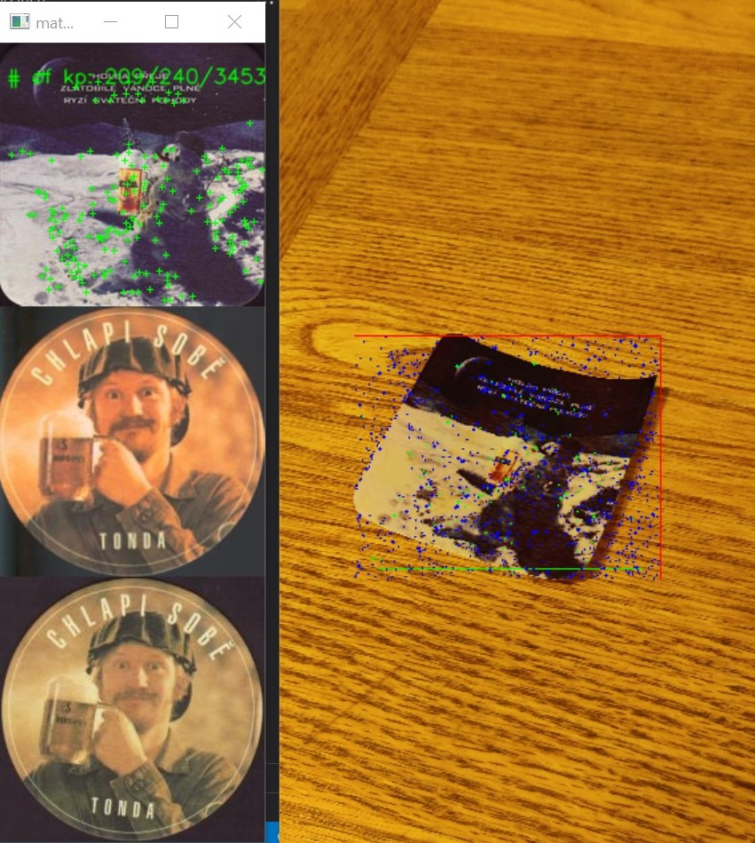

# CoasterDex
## by David Pažout and Dagur Elinór Kristinnson 

---

<!-- - Evolution of your project idea and where you are with respect to your goals.
- Results so far:
    - Elaboration of background material that you have discovered, including previous work (papers, existing systems), useful software, and data sets.
    - Methods tested and selected.  Explain the methods that you selected and how you adapted them to meet the needs of your application.
    - Numerical results of your performance measures, and how they evolved over the project.  What changes made the most improvement?  Compare your results to background work.
    - Live demonstration of the capabilities of your system. Show and discuss both success and failure.
- Work involved:
    - Division of labor - who did what. 
    - What has taken up the most time?
    - Particular challenges.
- Conclusions
    - What worked well first-time and what would you do differently, if doing the project over again?
    - Ideas for future work on the project or spin-offs.

--- -->

# Achievements 
## from first presentation
- success
    - determining if a coaster in present in a dataset and retrieve the match, otherwise add the coaster to the collection
    - matching a coaster from a complex scene (varied lighting and angles)
    - coaster recognition in a scene
    - custom dataset
- somewhat
    - transforming the marched coaster to a frontal view
    - retrieval from video at framerate
- failed
    - extract additional data

---

# Achievements 
## from last week presentation
- success
    - combine modules for full functionality
    - different search for faster coaster addition
- somewhat
    - async call implementation
- failed
    - *Color dependant features/recognition*

---

# Instance recognition - methods
- instance recognition overviews [1], [2]
- used methods: 
    - Contrast Limited Adaptive Histogram Equalization (CLAHE)
    - RootSIFT features, VLAD encoding, BallTree NN search
- other steps
    - key-point matching filter
    - dynamic database
    - bbox rescaling

---

# Instance recognition - results

---

 ___ 

---

# Coaster detection

---

<!-- 
- Work involved:
    - Division of labor - who did what. 
    - What has taken up the most time?
    - Particular challenges. 
-->

# Work involved
- Feature matching for instance level recognition
    - Parallelization
    - Integration of existing code
- Model training for coaster detection
    - Custom dataset creation
    - Model training environment errors took time to resolve
- Integration across systems 

---

<!-- 
- Conclusions
    - What worked well first-time and what would you do differently, if doing the project over again?
    - Ideas for future work on the project or spin-offs. 
-->

# Conclusion

- would would we do differently, if are doing the project over again?
    - better research methodology
    - better recording of the process
- future improvements
    - full parallelism
    - extension to a full application
    - proper database

---

# Thank you for your attention

---

# Questions?

---

# Sources
[1] https://ieeexplore.ieee.org/document/7935507
[2] https://arxiv.org/pdf/2101.11282.pdf
[GitHub] https://github.com/pazoudav/CoasterDex/tree/main